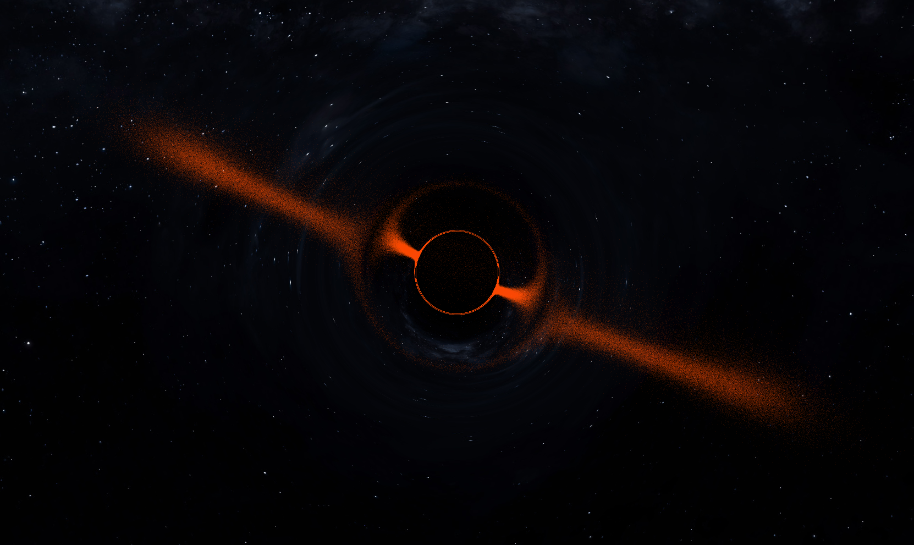

# Black hole simulation

## Introduction
The goal of this project is a cross platform 3D-Simulation (at least linux and windows), which shall display the physical (or rather optical) relativistic effects, which occur in the environment of a black hole. This will include light deflection, gravitational effects on particles as well as red- and blue-shift, respectively.

## Building
On linux/unix systems the project can be build with qmake. Currently the build, as well as the possible resulting binaries is, or rather are, only working on linux. The current goal is to provide 'building' on linux and on windows, whereat the binaries for an operating system shall only be build on the corresponding operating system. Maybe, a cross compiling mechanism for linux to compile for windows will be added as well.

## Current project state
At the time writing this (18/5/2019) the project is far from being fully developed. Although the GUI is only provisional just yet, some camera movement and the basic rendering code for the particles and the background is working, which means that there are no obvious visual errors, the framerate at 1000000 particles is quite good (with an NVIDIA GeForce GTX 1050 Ti) and the program does not crash if you use it normally.  
An image produced by the current project state is below

